# [Battleship Voyage](https://battleship-voyage.herokuapp.com/)

## 1. **Introduction**

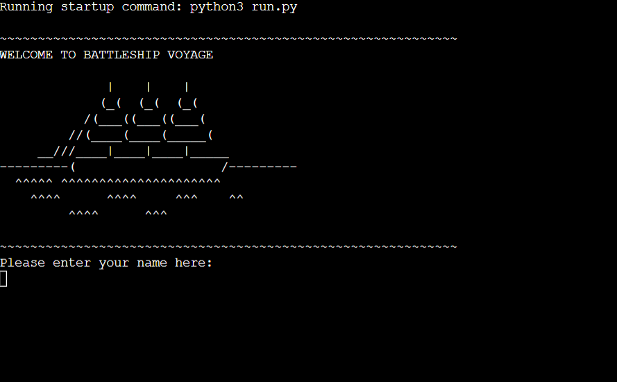

### **What is Battleship Voyage?**
Battleship voyage is a CLI or Command Line Interface program which connects the user with the computer to play a game of Battleships in its simplest form. 

[Click on me to view full game rules](https://www.thesprucecrafts.com/the-basic-rules-of-battleship-411069)
- This program allows the user to chose the size of each play board as well as the number of ships which will alter the number of rounds to be played. 
- Numbers are validated to be between 5 and 10 to allow each user to chose the level of difficulty of their game. i.e highest size and lowest number of ships would make the game hard and vice-versa for an easy game. 

The overall **Project Aim** is to design an interactive game using a back-end computer language, like Python. The program requests user input throughout the game from start to finish. Time library, *time.sleep(),* was used to pause at certain sections to enhance the game workflow while adding fun when the player needs to wait several seconds before realising whether they hit a ship or not. After each round, a user input offers the user the option to continue or quit the game if they so wish. 
Given the limited numbers between 5 and 10, the minimum number of rounds are 5 and maximum 10 to prevent users from overplaying or not playing enough during each game. 

### **How it works?**

1. The first CLI interaction between the program and the user is a **Welcome Message** followed by an input asking the user to enter a *name*. 

2. Once a name has been entered, the **game rules** are shown with time delay to ensure the user has no choice but to read the rules which is vital to fully enjoy the game. 

3. The user is then asked to input a number for **rows** and **cols** followed by the **number of ships** which will dictate the number of rounds. 

4. The game starts by **populating** both boards, identifying user's ship co-ordinates while hiding computers. 

5. Each round requests a **row and col input** from the user and using time delay, provide an answer and **show scores** at the end of each round.

6. Every round starts by the user pressing **Enter** and the game remains in loop until the number of guesses equal to the number ships, hence number of rounds. 

7. At the end, a *specific* feedback message is given to the user with a final updated board and offers the user to press a key to **play** again or **quit** after one game.

### **Who is it for?**
The original game was released in 1967 which indicates that the older generation would recognise the game be able to play as well as children from the age of 5 and over.

**New User** : Every new user has the ability to play as many games as they wish because the developer used random number to create ship co-ordinates and computer guesses. Rounds vary from 5 and 10 to ensure that each game isn't too short but not too long either.

**Returning User** : As mentioned above, every player has the ability to play unlimited number of games which means as a returning user, the only possible difference is the name input at the very start.

### **Planning**
The first thing on the developer's mind was to check the official game rules through this link :

[Battleship game rules](https://www.thesprucecrafts.com/the-basic-rules-of-battleship-411069)

**Planning original workflow of game**

The rough sketch of his first workflow outlined the main functions required when building the game. 

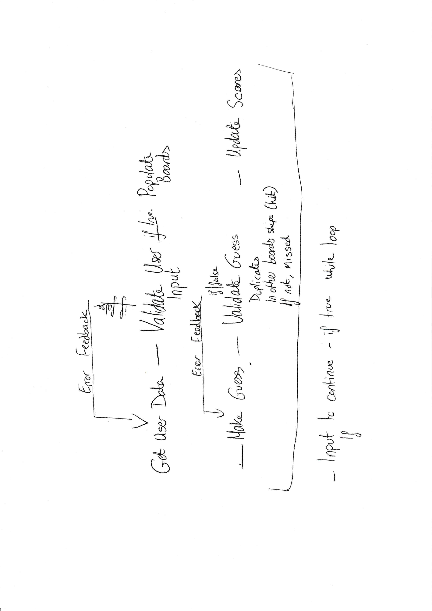

Given the inspiration from his *Love Sandwiches* project, he decided to create one main function which runs each game from start to finish called **new_game**.

Another function called **play_game** will run each round within the game using a *while loop*.

In terms of a **data model type**, he has decided to create a **class data model** for each board: *the player* and the *computer* through which he can call functions to print each board, add random ships to each board's lists etc. This will also be handy when requesting certain information such as ship co-ordinates, board name, updated board at the start of each round etc. 

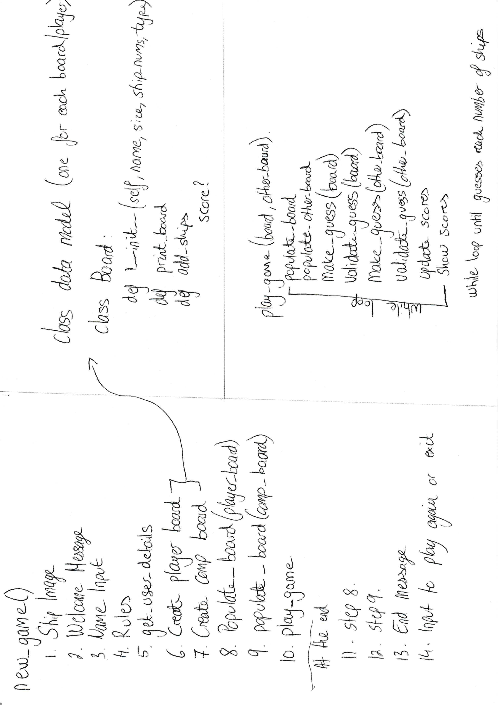

Once this was complete, he re-created his **game workflow** and used all of the above to build this battleship game.

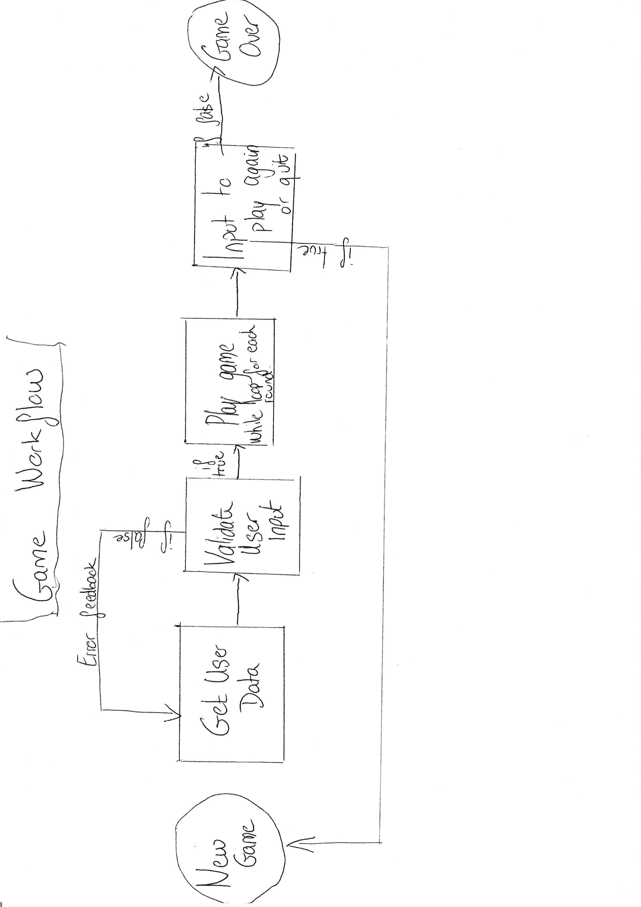

Screen size was also considered when planning this game so therefore, welcome image and design was planned to fit and look good on all screens. 

## 2. **Features (existing)**
Overall, the developer decided to use the *time library* to add delays in seconds at certain section to make the game more realisic, enjoyable and better from a visual perspective. 

### 1. **Welcome section**
- Displays a ship image

- Welcomes the user to Battleship Voyage

- Program starts to interact with the user by requesting name input.

### 2. **Rules section**
- Consists of 4 rules. 

- The developer added a 4 second delay to ensure that the player has no option but to read the rules to prevent confusion throughout the game.

- At the end, the user needs to press Enter in order to start the game. This is to ensure they have had enough time to read the rules and prepare for the game. 

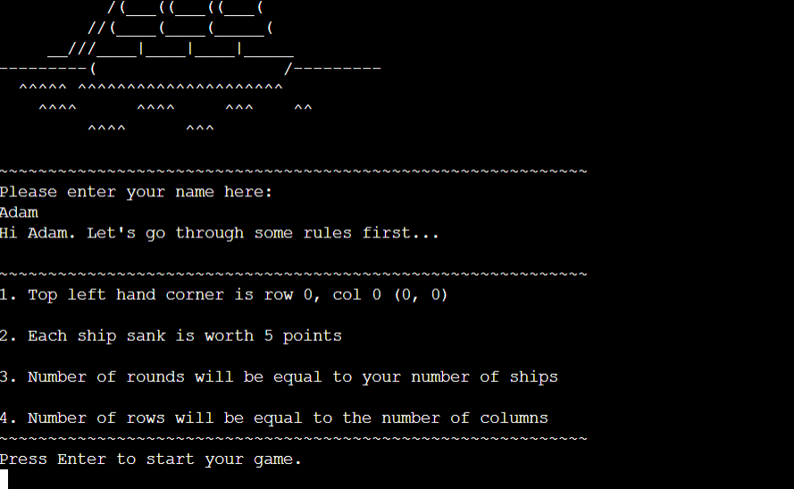

### 3. **User input section**
The user is given the ability to select the **size** of their and **number of ships** which will alter the *number of rounds* as stated in the rules section. Each input is validated and the game will only continue if the validation function returns **true**.

- User input for **size** (this number is going to be the width and length of the board used within each *board class*)

- Size validated to ensure it is between 5 - 10 and it is an integer.

- User input for **number of ships** (this number will be used to create random co-ordinates on each board). Play_game function stays in while loop while this number matches the number of guesses on each board.

- Identical validation to *size*.

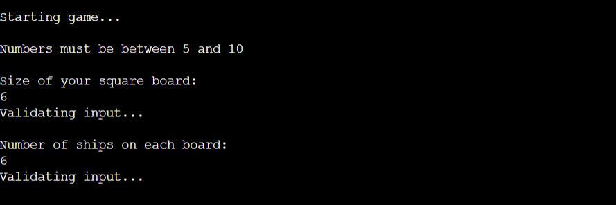

### 4. **Reminder Box**
- Reminds player that co-ordinates start with 0 rather than 1 and also displays range of co-ordinates. 

- Displays number of ships chosen by user and hence, the number of rounds. 

- Play_game function starts

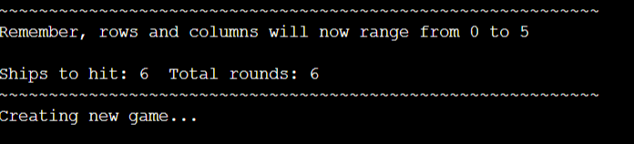

 ### 5. **In-game section**
 - Both boards are displayed. For the player, the random ships are marked with **@**. For the computer, they're hidden. 

 - Two inputs are requested from the user. A **row number** and **column number**. 

 - Both inputs above are first validated using the same function as for the *size* and *number of ships*. The validation function was created using parameters which can be manipulated for this reason. 

 - Another validation function first ensures that the co-ordinates have not been guessed yet and then checks if it matches the other board's ship co-ordinates. If it hits a ships, it marks it with **O** and if its a miss, marked with **X**. This all happens within each class to ensure when each board is called again next round, that these markings also display.

 - Once co-ordinates are valid and checked, the player's co-ordinates are shown as a way of confirming and using time delay to add excitement, the player has got to wait several seconds before told whether a ship was a hit. 

 - The same goes for the computer.

 - If either hit a ship, the **score** variable built into each board's class is updated.

 - At the end of each round, this score is called from both classes and displayed to show current scores.
 - Next round will not start unless, user presses **Enter** or if they wish to quit, press **q**

**Part 1.**
 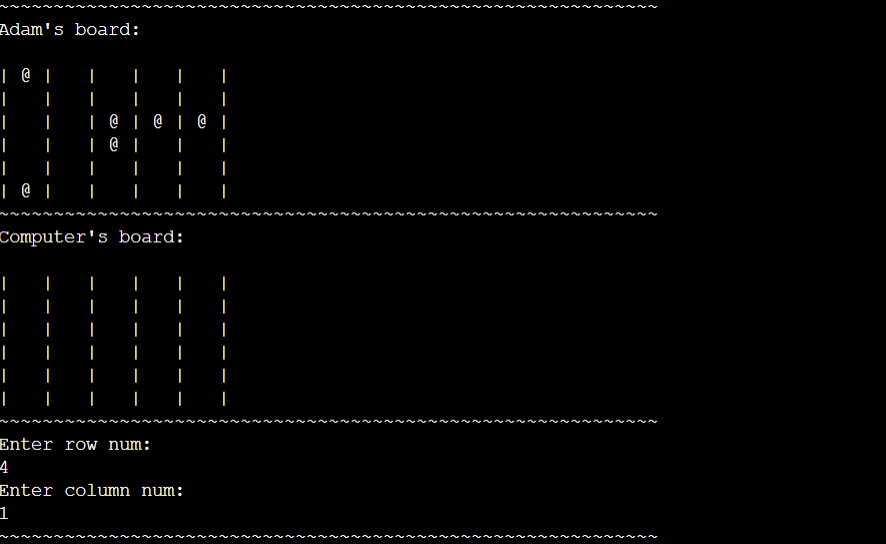

**Part 2.**
 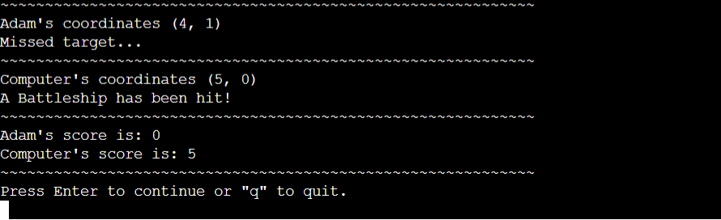

 ### 6. **End section**
 - Once the number of guesses match the number ships or rounds, when the player inputs **Enter** next, a message is printed to tell the player that the game is over. 

 - Displays a specified message to the player depending on their score against the computer. 

 - Displays final board for both sides.

 - A final input requests the user to enter **y** to restart the *new_game* function or **n** to display a **goodbye message** and break the game loop. 

**Part 1.**
 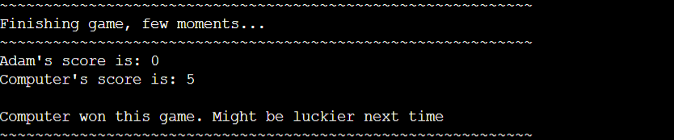

**Part 2.**
 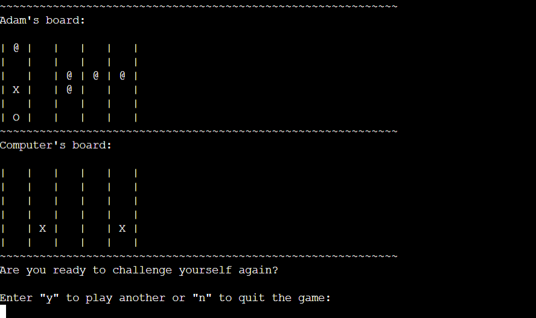

## Features (new ideas)
- Instead of number co-ordinates, letters could be used to represent each columns and numbers to represent rows. Possibly displayed with each board so the user has a better understanding of rows and cols. 
- Increase the size of board to allow bigger ships i.e ships with at least two co-ordinates, just like in the real, physical game. 
- Instead of using CLI, another form of interface could be used which may come with better visual design. 
- Use other libraries to include actual ship objects which represent the ships rather than **@**.
- Board design could definitely be improved by adding more space to each grid to fit boat objects.
- Add more action when a ship is hit rather than just text. For example, an explosion image. 

## 3. Testing and Bugs Fixed/Unfixed

### **Validator Testing**

Battleship Voyage is a program purely built using Python so once the code was complete, the developer pasted through **PEP8** and it passed with no errors or issues.

[Link to PEP8](http://pep8online.com/)

Before testing the code, the developer was aware that he needs to leave a blank line at the end of his code which he has done in GitPod as shown below, however, in order to not show as an error, he needed to add this extra line within PEP8 as it does not show on GitHub.

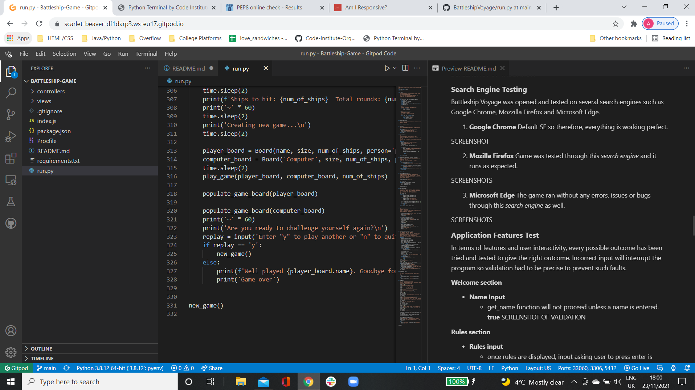

Once the extra line is added at the end of the code.

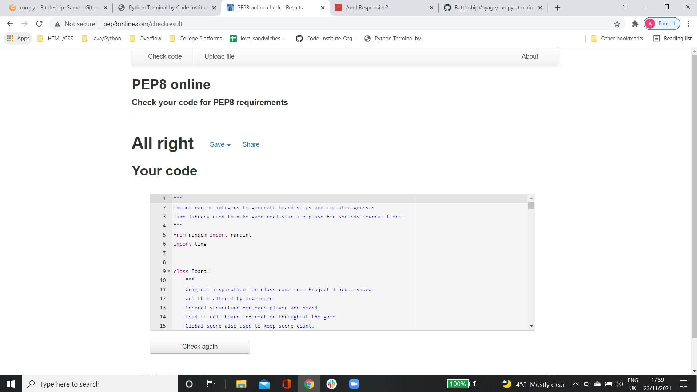

### **Search Engine Testing**

Battleship Voyage was opened and tested on several search engines such as Google Chrome, Mozzilla Firefox and Microsoft Edge. 

1. **Google Chrome**
Default SE so therefore, everything is working perfect.

2. **Mozilla Firefox**
Game was tested through this *search engine* and it runs as expected. 

**Welcome section**
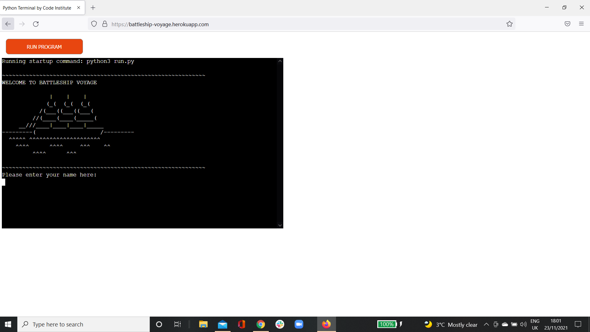

**In-game section**
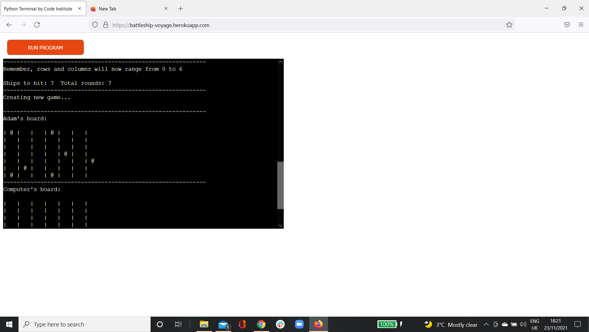

**End section**

3. **Microsoft Edge**
The game ran without any errors, issues or bugs through this *search engine* as well. 

**Welcome section**
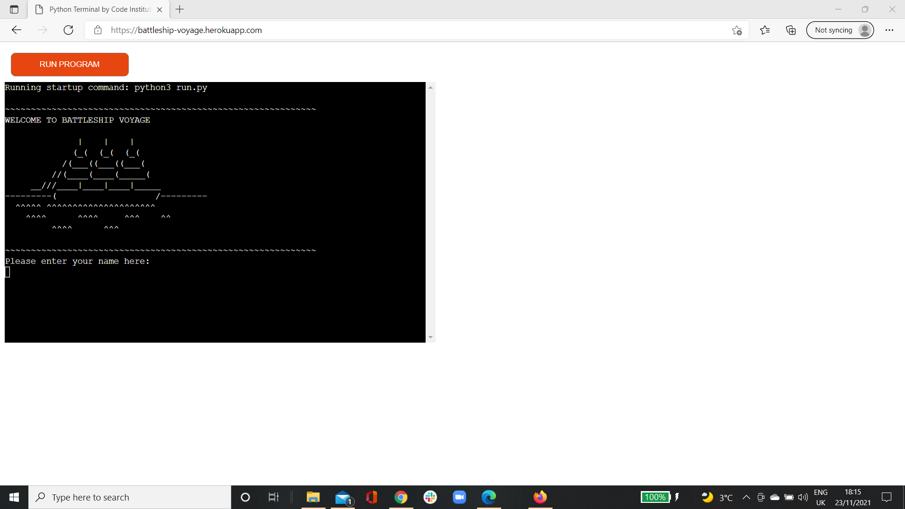

**In-game section**

**End section**
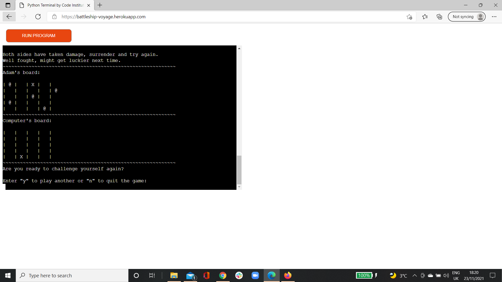

### **Application Features Test**

In terms of features and user interactivity, every possible outcome has been tried and tested to give the right outcome. Incorrect input will interrupt the program so validation had to be precise to prevent such faults. 

**Welcome section**
- **Name Input**
    - get_name function will not proceed unless a name is entered. **true**

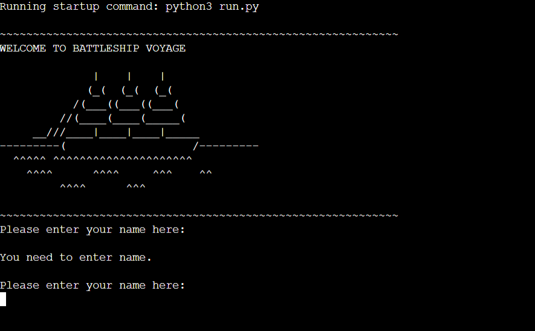

**Rules section**
- **Rules input**
    - once rules are displayed, input asking user to press enter is showing and working. **true**
    - is user mistakenly presses any key before enter, the program will still continue instead of crashing. **true**

**Get User Data section**

**get size input**
- only numbers between 5 and 10 allowed . **true**
- only whole integers allowed. **true**

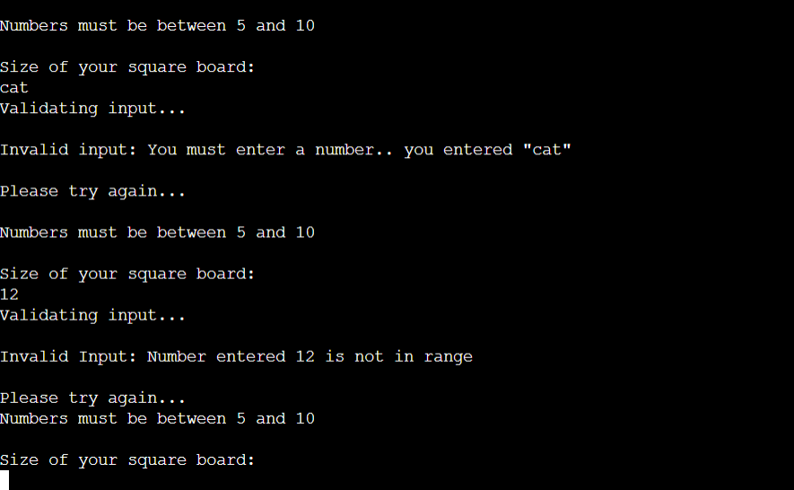

**get number of ships input**
- only numbers between 5 and 10 allowed . **true**
- only whole integers allowed. **true**

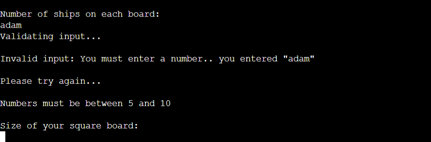

**Reminder Section Box**
- correct information displayed to user before game starts.
    - range. **true**
    - number of ships. **true**
    - number of rounds. **true**

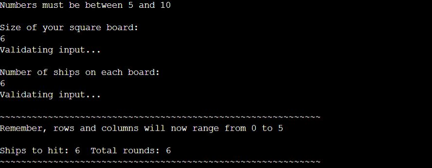

**In-game section**

- **row number input**
    - only numbers within range allowed to be entered. **true**

    - only integers are accepted. **true**

- **col number input**
    - only numbers within range allowed to be entered. **true**

    - only integers are accepted. **true**

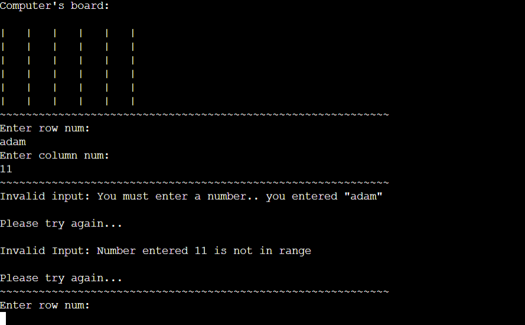

- updated scores displayed at the end of each round. **true**

- next round only starts when user clicks *Enter*. **true**

- if user enters *q* and clicks enter, game finishes. **true**

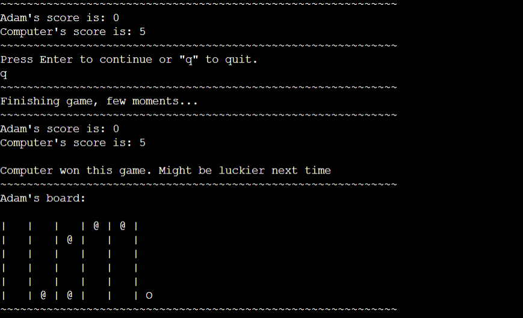

- when number of guesses equal to the number of ships, game finishes. **true**

**End section**
- when user clicks *Enter*, final scores and board are displayed. **true**

- specific feedback messages print according to final scores. **true**

**Input to play again**
- when *y* entered, game reloads. **true**
- when *n* entered, goodbye message displayed and game finishes. **true**

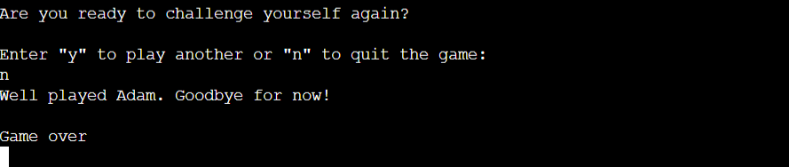

### **Screen Responsive Testing**

For this *python* based program, [Am I Responsive](http://ami.responsivedesign.is/) website was used to test and check how the CLI is showing within the browser on multiple size screens. 

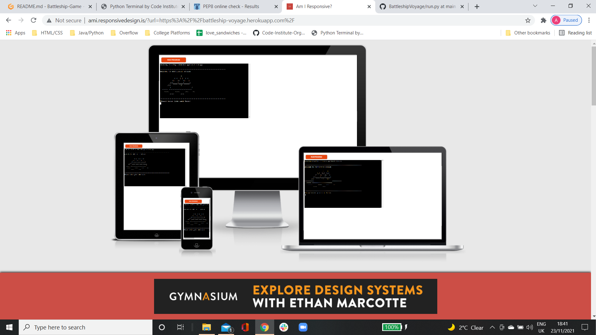

### **Other ways of testing responsiveness**
The developer has tested the game on his own mobile and other devices while asking other family members to do the same and game runs as expected. 

### **Fixed Bugs**
1. When the name input was left blank and pressed enter, the game would continue with no name rather than asking the user to enter something. The developer created the **get_name** function and only return a name if something is entered. Solved the arising issue. 

2. The developer went down the root of updating scores through a function which returns an updated value which caused a bug and scores were not updating. 
He then realised he can just use the class of each board to he created a score variable with a value of 0 and 5 gets added for each ship hit. Solved this issue. 

3. The validated_user_data function did not return the correct error message between incorrect numbers and integers. The developer had to rewrite the function from scratch which worked and eliminated the bug. 

### **Unfixed Bugs**
Within this game, no erros or unfixed bugs are identified when testing the game. 

## 4. **Deployment**

**Heroku** was used to deploy this *python based* project. The data was pushed from *GitPod* to *GitHub* which was linked and deployed through *Heroku*.

The steps needed to follow to deploy Battleship Voyage are:

1. Go to Heroku's official website.

2. Log in and click on *new* in the top right corner.

3. Select *Create new app*.

4. Chose an *app-name* and click on *Create app*.

5. Within the nav bar, click on *Settings*.

6. Select *Reveal Config Vars* in the centre.

7. Add *PORT* for KEY and *8000* for VALUE and click *Add*. (Nothing else required for this project here.)

8. Click on *Add buildpack*.

9. Select *python* first and click on *Save changes*.

10. Click on *Add buildpack* again.

11. Select *nodejs* and click *Save changes*. (Make sure python is on top and nodejs is below!)

12. Scroll back to the top and from the nav bar, click on *Deploy*.

13. Under Deployment method, select *GitHub*.

14. Right under, search for Battleship Voyage's repositary and select it. 

15. Click *Connect*.

16. For automatic updates with GitPod pushes, click on *Enable Automatic Deploys*.

17. Click on *Deploy Branch*. (Once deployed, link will display at the bottom of this page.)

## 5. Credits

## **Content**

#### **Ship Image**

**Name** : ASCII Art Boat

**Link** : [https://textart.io/art/tag/boat/1](https://textart.io/art/tag/boat/1)

#### **Time Delay library**

**Name** : Stack Overflow - Time Delay

**Link** : [https://stackoverflow.com/questions/510348/how-can-i-make-a-time-delay-in-python](https://stackoverflow.com/questions/510348/how-can-i-make-a-time-delay-in-python)

#### **Class Function set up**

**Name** : 1. Code Institutes LMS - Portfolio 3: Project Submission - Portfolio Project 3 Scope.

**Link** : [https://learn.codeinstitute.net/courses/course-v1:CodeInstitute+PE_PAGPPF+2021_Q2/courseware/b3378fc1159e43e3b70916fdefdfae51/605f34e006594dc4ae19f5e60ec75e2e/](https://learn.codeinstitute.net/courses/course-v1:CodeInstitute+PE_PAGPPF+2021_Q2/courseware/b3378fc1159e43e3b70916fdefdfae51/605f34e006594dc4ae19f5e60ec75e2e/)

**Name** : Code Institute's online LMS - Python - Defining Classes in Python

**Link** : [https://learn.codeinstitute.net/courses/course-v1:CodeInstitute+CPP_06_20+2020_T1/courseware/272f493b4d57445fbd634e7ceca3a98c/c75ed529d8f14d5aa5f359281c76c834/?child=first](https://learn.codeinstitute.net/courses/course-v1:CodeInstitute+CPP_06_20+2020_T1/courseware/272f493b4d57445fbd634e7ceca3a98c/c75ed529d8f14d5aa5f359281c76c834/?child=first)

### **Workflow Structure Idea**

**Website** : www.youtube.com

**Name** : CSCI 105 - Python Review: Creating a Battleship Game

**Link** : [https://www.youtube.com/watch?v=3dXkgVej7M0&t=2s](https://www.youtube.com/watch?v=3dXkgVej7M0&t=2s)

#### **Slack Community**
- Keeping a close eye on other student's work and question relating to project 3 through Slack - **# project-portfolio-3**

